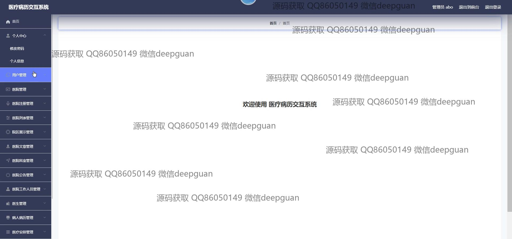
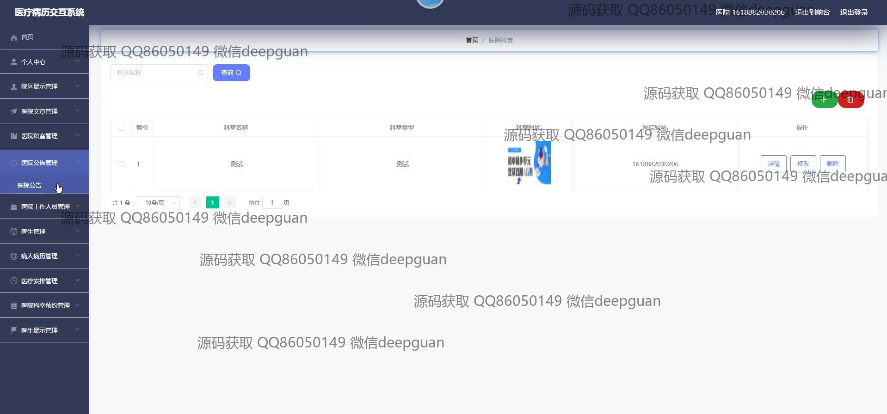
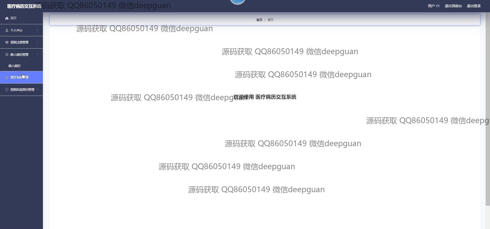

<h1 align="center">基于BB平台的医疗病历交互系统</h1>

## 简介
医疗病历交互系统：角色分为用户、医院和医生；具备登录注册、病历管理、医生信息管理、医院信息管理和数据共享等功能，提升医疗信息管理和交互效率。    --计算机毕业设计源码；毕设源码；java毕业设计源码

## 联系方式

<h3 align="center">获取完整代码与数据库文件 + 微信：deepguan QQ: 86050149 QQ群: 783742310</h3>

<h3 align="center">可帮忙远程部署 包运行成功！提供远程部署、修改代码、设计文档指导、代码讲解等服务！</h3>

## 功能介绍（完整见运行截图）
管理员：管理员可以通过系统访问个人中心、用户管理、医院和医生管理模块，实现对医院、医生及病人病历的全面管理和审核。页面提供导航栏方便切换首页、医院文章、院区展示等模块，同时可编辑医院公告、展示管理和文章内容，支持多种文件上传，确保信息高效交互和安全管理。

用户：系统为用户提供登录、注册功能，并可访问个人中心管理个人信息，完善账户资料。用户能浏览医院信息、医生展示、院区展示和文章内容，通过系统页面进行信息查询和互动。页面设计简洁，采用导航菜单快速定位到感兴趣的内容，轻松进行信息更新和其他操作，提升用户体验。

医生：医生用户可通过个人中心更新个人信息，包括填写和修改个人基本资料如编号、姓名和详情信息。同时，医生可以管理病人病历，查看和编辑病历内容和医疗安排，加强患者管理。系统提供医生展示功能，以及与患者的信息交互，促进院内外的沟通，保障医疗服务的高效和质量。

患者：患者可利用个人中心查看和更新个人信息，通过病历交互系统录入、查询、共享医疗信息，安排查看预约。系统支持高效的病历信息管理、查询和交互，助力医疗数据流通。患者可以与医生进行沟通，获得准确的诊断和服务，提高就医体验和信息传递效率。

## 运行截图

本代码来源于网络,仅供学习参考使用!

